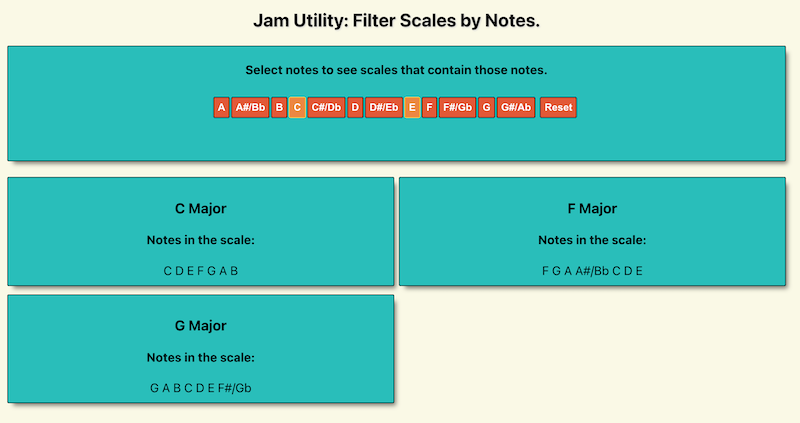

## Jam Utility 
 
#### Jam Utility is a helper tool for musicians to use when writing or playing music, either alone or together. 
Have a riff or melody and want to know what other material might work well with it? 
Jam Utility creates and filters a library of musical scales. Select the notes in your riff or melody, and Jam Utility will tell you which musical scales contain those notes! It will display all the notes within each matching scale, as well as the common chords built from that scale. Nice! 

#### ~~Visit the current deployment of Jam Utility here: [https://jam-utility.herokuapp.com](https://github.com/zhanknight/jam-utility)~~
*Jam Utility is currently not deployed following Heroku eliminating free deployments.*
*I am currently fully rewriting Jam Utility as a Blazor standalone WASM app. See the blazor-rewrite branch.*

*Jam Utility is a work in progress! I'm building it as a way to learn React!*
*Jam Utility currently "knows" the major and minor scales as well as the other five greek modes: Dorian, Phrygian, Lydian, Mixolyian, and Locrian.*
